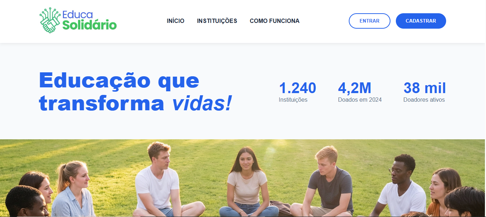
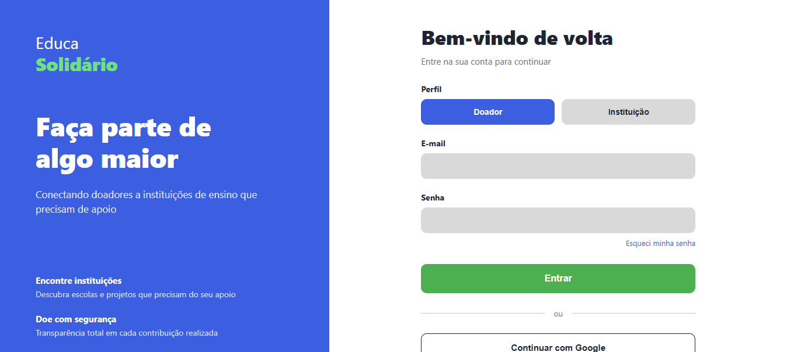
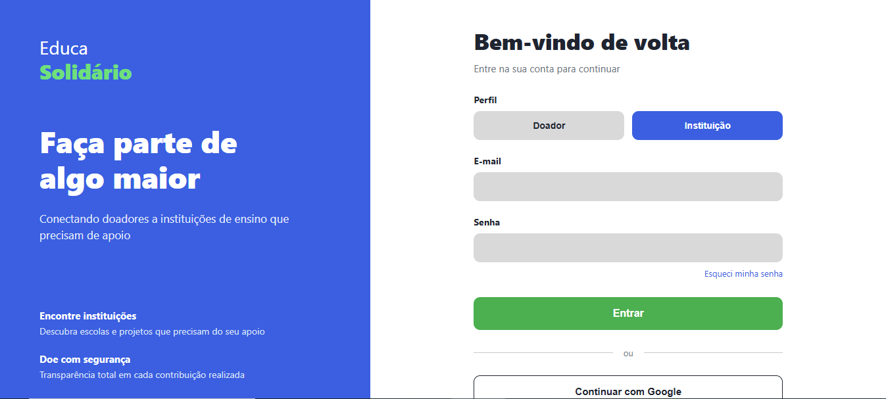
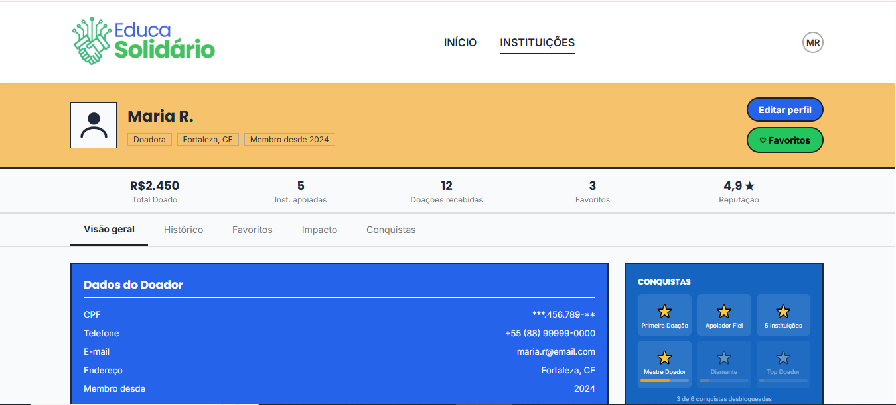
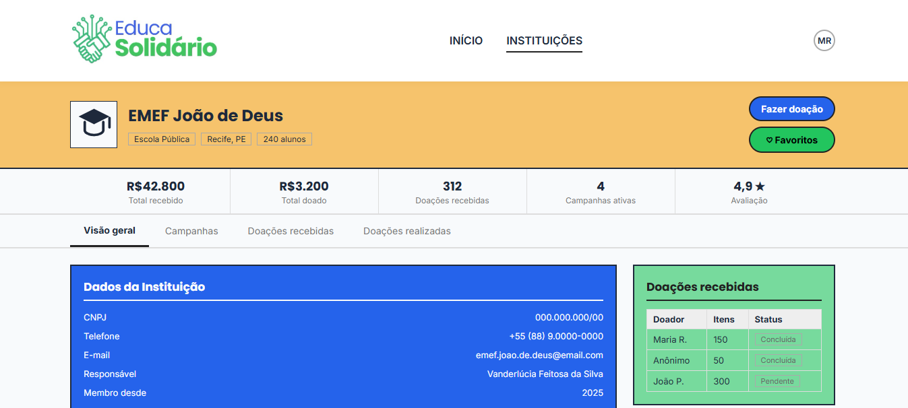
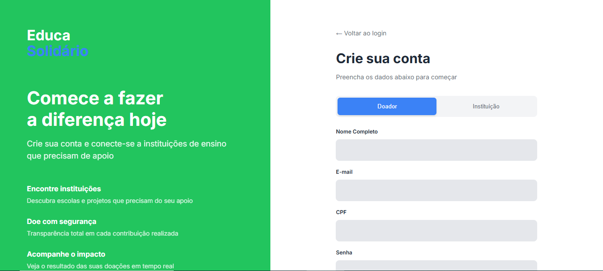
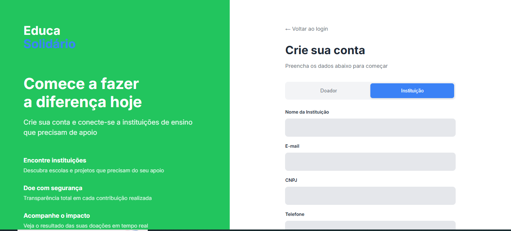
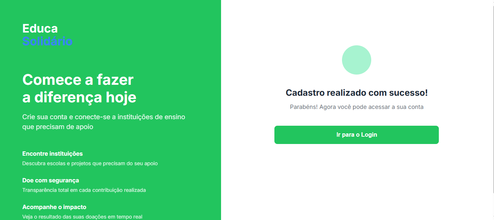

# EducaSolidario

EducaSolidario é uma aplicação web voltada para a **doação e o reaproveitamento de materiais escolares** e para o fortalecimento de **projetos educacionais e comunitários**.

Na plataforma, **instituições** (como escolas, ONGs e projetos sociais) podem se cadastrar, divulgar suas **necessidades de materiais** e apresentar **projetos** como hortas comunitárias escolares, minicursos de reaproveitamento de materiais, oficinas e outras iniciativas. Já a **população em geral** pode acessar essas informações, conhecer os projetos e:

- realizar doações de materiais escolares;
- entrar em contato com a instituição de interesse;
- apoiar iniciativas que promovam educação, sustentabilidade e inclusão social.

Além disso, a plataforma também permite que **instituições troquem recursos entre si**, facilitando o reaproveitamento de materiais e a construção de uma rede colaborativa.

## 1. Problema
A desigualdade socioeconômica impõe barreiras signficativas ao desenvolvimento educacional, fazendo com que diversas crianças e jovens em situação de vulnerabilidade iniciem o ano letivo sem os recursos básicos necessários para o aprendizado. Em contrapartida, observa-se um ciclo contínuo de desperdício na sociedade: materiais em bom estado de conservação que poderiam ser reaproveitados e que infelizmente acabam sendo descartados ou esquecidos ao final de cada período letivo por famílias que não precisam mais deles. A solução proposta atua justamente nessa problemátca, conectando o excedente de material à escassez do mesmo de maneira promover não somente a sustentabilidade ambiental, mas também a equidade e a dignidadde no acesso à Educação.

## 2. Objetivo do Sistema
O principal objetivo do sistema é promover a missão do EducaSolidário, atuando com uma plataforma web facilitadora entre quem deseja ajudar e quem precisa do apoio. O sistema tem como visão estruturar e apoiar o processo de doação e reaproveitamento de materias escolares, transformando a solidariedade em uma ação prática, acessível e além de tudo organizada. Portanto, o projeto busca diminuir a exclusão escolar motivada pela falta de recursos básicos, ao mesmo tempo em que incentiva práticas de consumo consciente e economia dentro da comunidade.

## 3. Visão Geral do Sistema e Jornada do Usuário
O Educasolidário funciona como uma ponte de encontro digital que centraliza e cruza informações de oferta e demanda de materiais escolares. A jornada se dá no sistema por meio de duas pespectivas complementares:

* Para Instituições (quem recebe): Organizações sociais,cnpjs, escolas ou projetos comunitários que atendem famílias vulneráveis realizam um cadastro na plataforma. Após o cadastramento, essas instituções podem registrar suas demandas, criando listas de itens necessários que ficam na fila como prioridade para os seus assistidos.
* Para os Doadores: Pessoas físicas ou jurídicas que possuem materiais em bom estado acessam a plataforma e visualizam uma tela com as demandas existentes. O doador pode explorar esses pedidos, selecionar a instituição que deseja apoiar e formalizar a sua intenção de doação no sistema. A partir desse momento, a plataforma fornece as orientações e as informações necessárias para que a entrega do material seja organizada e finalizada de forma segura entre as partes.

## 4. Possíveis usos da nossa solução

Um primeiro uso seria por **famílias em situação de vulnerabilidade socioeconômica** que têm dificuldade para comprar materiais escolares para crianças e adolescentes. Por meio da plataforma, essas famílias podem encontrar instituições próximas que recebem doações de mochilas, cadernos, lápis, livros e outros itens, facilitando o acesso a recursos básicos para a permanência na escola.

Do lado das **instituições de ensino, ONGs e projetos sociais**, a aplicação pode ser usada para organizar e divulgar suas demandas de forma clara. Uma escola, por exemplo, pode cadastrar um projeto de *horta comunitária escolar* ou de *minicurso de reaproveitamento de materiais*, especificando os materiais necessários (ferramentas, sementes, materiais recicláveis, etc.). Assim, pessoas da comunidade e outras instituições conseguem visualizar essas necessidades e direcionar suas doações ou apoio de maneira mais eficiente.

Como se trata de um **projeto universitário**, a solução também pode ser utilizada por **laboratórios, grupos de pesquisa e projetos de extensão** que atuam junto a escolas em situação de vulnerabilidade. Um laboratório universitário que tenha uma linha de atuação com escolas públicas, por exemplo, pode utilizar a aplicação para cadastrar as escolas parceiras, mapear suas necessidades e divulgar projetos em andamento. Nesse cenário, o laboratório funciona como uma ponte entre a universidade, as escolas e potenciais doadores, centralizando informações e facilitando a articulação das ações.

A solução também pode ser útil para **negócios do mundo real**, como papelarias, gráficas e empresas que lidam com estoques de material escolar. Esses estabelecimentos poderiam utilizar a plataforma para doar materiais excedentes, coleções antigas ou itens próximos ao fim de linha, reduzindo desperdícios e fortalecendo sua responsabilidade social. Além disso, a participação da empresa nesses projetos pode gerar visibilidade positiva e aproximação com a comunidade local.

Por fim, a plataforma pode atuar como uma **rede de troca entre instituições**, não apenas de materiais, mas também de projetos e conhecimento. Por exemplo, uma escola que já possua estrutura e know-how para montar uma **rádio estudantil** pode, por meio da aplicação, entrar em contato com outra instituição interessada em implementar um projeto semelhante. A primeira escola pode compartilhar sua experiência, orientações e até recursos excedentes, enquanto a segunda recebe apoio para colocar a iniciativa em prática. Dessa forma, nossa solução contribui para um uso mais sustentável dos recursos, incentiva o reaproveitamento de materiais e fortalece iniciativas educacionais e comunitárias no mundo real.

## Como utilizar a aplicação (Componente Extensionista Sprint #3 PI III)

O *educaSolidario* foi desenvolvido para ser simples e intuitivo ao acessar e usar, bastando apenas nível básico de familiaridade com computador e internet.

Esta seção explica como qualquer pessoa pode utilizar a plataforma, para quem ela foi pensada para atender e como a solução pode gerar impacto real na comunidade.

**Quem pode usar a plataforma?**

A aplicação atende a dois perfis de usuário, com necessidades complementares a saber:

- Doadores: qualquer pessoa física que tenha materiais escolares, livros ou demais recursos educacionais em bom estado e queira direcioná-los a quem precisa. Não é necessário conhecer previamente a instituição que vai receber a doação - a plataforma cuida dessa conexão.

- Instituições: escolas, ONGs, projetos sociais ou qualquer organização de caráter educacional que atendam famílias em situação de vulnerabilidade e precise de materiais escolares para as suas atividades. O cadastro das instituições é feito com CNPJ, garantindo que as demandas publicas provenham de organizações reais e verificáveis.

**Como acessar o sistema**

Qualquer pessoa pode acessar a página inicial da aplicação pela internet através de um navegador, sem precisar instalar nada. A partir daí, o usuário pode se cadastrar como Doador (informando CPF) ou como Instituição (informando CNPJ). Após o cadastro e o login, cada perfil tem acesso às funcionalidades adequadas ao seu perfil.

**Como usar as principais funcionalidades**

*Nessa subseção, explicamos as funcionalidades de consultar e doar (para o doador) e de cadastramento de solicitação de doação e acompanhamento do status (para a instituição).*

- Para doador: 
1. Acessar o dashboard após o login e consulte as instituições com necessidades cadastradas;
2. Escolha a instituição que deseja apoiar e veja os itens que ela precisa;
3. Registre sua intenção de doação. A plataforma fornecerá as informações de contato e as orientações a respeito da entrega da doação;
4. Acompanhe o histórico das suas doações e veja o impacto acumulado no seu perfil.

- Para instituição:
1. Faça o cadastro e crie o perfil da sua organização com dados de contato e localização;
2. Cadastre as necessidades: informe os tipos de materiais que precisam, a quantidade e o nível de urgência;
3. Aguarde a conexão com doadores interessados — a plataforma exibirá as suas demandas para todos os usuários cadastrados;
4. Atualize o status dos itens conforme as doações chegam, de modo a se manter sempre disponível para novas doações.

**Quem se beneficia**

Os dois perfis (Doadores e Instituições) representam diversos beneficiários, como:

- Crianças e adolescentes em situação de vulnerabilidade que começam o ano letivo com os materiais que precisam, sem que a família precise escolher entre as despesas básicas e a lista escolar;

- A comunidade local como um todo, que passa a ter um canal organizado para transformar a solidariedade em ação prática, sem depender de campanhas pontuais ou de contatos informais;

- Negócios locais (ex.: papelarias) e escolas particulares, que podem usar a plataforma para dar destino útil a estoques parados, reduzindo desperdício e fortalecendo a sua relação com a comunidade.

**Exemplos de uso em cenários reais**

Cenário 1 — Família doadora: ao final do ano letivo, uma família percebe que os livros do 6º ano ainda estão em ótimo estado, mas os filhos não vão mais precisar deles. Em vez de guardar na prateleira ou descartar, acessam o *educaSolidário*, encontram uma escola que cadastrou esses livros como necessidade urgente e registram a intenção de doação em poucos minutos;

Cenário 2 — ONG educacional: um projeto social que oferece aulas de teatro para crianças de 6 a 12 anos precisa de roupas temáticas, tecidos e sapatos. Após se cadastrarem no *educaSolidário*, aparecem três doadores (famílias nas quais os filhos cresceram e não mais usam esses materiais), atendendo a necessidade urgente da ONG para a realização de suas aulas;

Cenário 3 — Rede entre instituições: uma escola estadual que renovou seus materiais de ciências tem microscópios antigos que ainda funcionam bem. Por meio da plataforma, entra em contato com uma escola municipal que precisa exatamente desse equipamento para montar um laboratório, e as duas instituições combinam a transferência diretamente.

**Reflexão sobre o impacto**

O *educaSolidario* parte da premissa de que o material que sobra em um lugar falta em outro. E que a falta de informações e grupos dedicados a otimizar o uso desses materiais implica em desperdício, de um lado, e de carência, em outro. A tecnologia da plataforma, portanto, é o meio que torna essa conexão mais rápida, organizada e confiável do que se fosse feita por outros meios (como telefone ou redes sociais genéricas). A cada doação concluída, o sistema reduz não só a carência de recursos escolares, mas também o desperdício de materiais que ainda têm muito uso pela frente.

Entendemos que é uma contribuição pequena, mas concreta, para um problema que afeta diretamente o acesso à educação no Brasil.

## 5. Projeto físico de banco de dados e sua importância para quem está aprendendo a programar.

O projeto físico de banco de dados é a última etapa do processo de modelagem de um banco. Nela, o modelo criado anteriormente é implementado em um sistema de gerenciamento de banco de dados (como MySQL, PostgreSQL ou Oracle), definindo como os dados serão armazenados no computador.

Essa fase envolve decisões importantes, como a criação de tabelas, definição de tipos de dados, uso de índices e estratégias para melhorar o desempenho das consultas, além de considerar o uso de memória e espaço em disco.

Para quem está aprendendo a programar, o projeto físico é fundamental porque mostra como a estrutura do banco influencia diretamente o funcionamento da aplicação. Um bom projeto físico pode deixar o sistema mais rápido, estável e eficiente, enquanto um projeto mal feito pode causar lentidão e problemas de desempenho, mesmo com um código bem escrito.

## 6. 🎨 Interface Humano-Computador (IHC) e Prototipação

Como parte do nosso compromisso em criar uma aplicação que realmente atenda às necessidades da comunidade, aplicamos conceitos de Interface Humano-Computador (IHC) e Design Centrado no Usuário no desenvolvimento do EducaSolidário.

### 6.1. Como prototipar um Wireframe? (Guia Prático)
Um wireframe é como o "esqueleto" ou a planta baixa de um site ou aplicativo. Ele serve para organizar as informações na tela antes de nos preocuparmos com cores ou imagens. Se você deseja prototipar um, siga estes passos:

6.1.1. **Entenda o Objetivo:** Antes de desenhar, saiba o que o usuário precisa fazer naquela tela (ex: fazer login, encontrar um projeto para apoiar).
6.2.2. **Faça um rascunho no papel (Baixa Fidelidade):** Não vá direto para o computador. Desenhe caixas e rabiscos em um caderno para testar ideias de layout de forma rápida e barata.
6.3.3. **Use ferramentas digitais (Média Fidelidade):** Utilize softwares gratuitos como Figma, Balsamiq ou Draw.io. Crie retângulos para imagens, linhas para textos e formas simples para botões.
6.4.4. **Foque na estrutura, não na estética:** Evite usar cores (trabalhe em escala de cinza) e não perca tempo escolhendo fontes bonitas. O objetivo é validar a hierarquia da informação e onde cada elemento vai ficar.
6.5.5. **Peça feedback:** Mostre o "esqueleto" para outras pessoas e veja se elas conseguem entender como navegar de forma intuitiva.

### 6.2. O Impacto do Design Centrado no Usuário na Sociedade

O Design Centrado no Usuário (DCU) vai muito além de criar telas visualmente agradáveis. Ele trata de colocar as necessidades, limitações e contextos das pessoas reais no centro do desenvolvimento de software. No nosso dia a dia, sistemas mal desenhados causam frustração, exclusão e perda de tempo — pense em um idoso tentando usar um aplicativo de banco confuso ou uma pessoa com deficiência visual que não consegue navegar em um site governamental porque ele não tem suporte a leitores de tela.

Quando aplicamos o design centrado no usuário, criamos sistemas mais intuitivos, eficientes e acessíveis. No contexto do **EducaSolidário**, isso significa projetar interfaces onde uma escola com poucos recursos tecnológicos consiga cadastrar suas necessidades de forma fácil. Significa garantir alto contraste e botões claros para que qualquer doador realize sua ação sem confusão. Em resumo, melhorar a qualidade da Interface Humano-Computador é promover cidadania e inclusão digital, garantindo que a tecnologia sirva à sociedade como uma ponte facilitadora, e não como uma barreira.

### 6.3. Importância da Experiência do Usuário (UX)

A Experiência do Usuário (UX) está relacionada à maneira como as pessoas percebem e utilizam um sistema, site ou aplicativo durante a interação com a interface. Isso envolve facilidade de uso, organização das informações, acessibilidade, eficiência e satisfação do usuário. Dessa forma, a UX não se preocupa apenas com a aparência visual da interface, mas também com o funcionamento do sistema e com a forma como o usuário se sente ao utilizá-lo.

A UX é importante pois busca tornar os produtos mais intuitivos, funcionais e agradáveis de usar. Quando uma interface é bem planejada, os usuários conseguem realizar tarefas com mais rapidez, segurança e menos dificuldades, evitando erros e frustrações. Além disso, uma boa experiência aumenta a satisfação e a confiança das pessoas no sistema, contribuindo para que ele seja mais utilizado e aceito pelos usuários.

Nos dias atuais, as pessoas têm a necessidade de tecnologias rápidas e intuitivas, por isso um bom design de interface facilita o acesso e melhora a interação com diferentes sistemas no dia a dia, impactando positivamenta suas vidas. Em ambientes como escolas, empresas, hospitais e aplicativos de serviços, interfaces simples e organizadas ajudam na produtividade, na comunicação e na eficiência das atividades. Por isso, pensar na experiência do usuário é essencial para desenvolver sistemas mais acessíveis, úteis e eficientes no mundo real.

## 7. Decisões Tomadas ao longo do desenvolvimento

#### 7.1. Design e Identidade Visual
O Design do protótipo de alta fidelidade feito no Figma foi pensado no conforto visual e clareza na navegação dos usuários. Nesse sentido, as seguintes decisões foram tomadas: 

- **Logo:** Símbolo de mãos dadas e ligações - representa conexão e colaboração;
- **Paleta de cores:** o azul representa conhecimento, o verde, colaboração, trazendo ainda mais sentido à logo. Assim, adicionando as cores âmbar e grafite, para destaques e textos, a escolha da paleta traz um padrão visual e funcional para a plataforma, proporcionando consistência entre as interfaces;
- **Fontes:** as fontes selecionadas foram a **Poppins** para os títulos e a **Inter** para textos e interfaces. A primeira por ser moderna, geométrica e amigável; a segunda por sua legibilidade, limpeza e tecnologia.

#### 7.2. Arquitetura e Código
- **Escolha do Modelo Relacional:** Optou-se pela utilização de um banco de dados relacional para mapear com precisão matemática os relacionamentos lógicos do ecossistema do EducaSolidario. A integridade referencial garante que entidades complexas (como as relações N:N entre doadores, materiais cadastrados e as necessidades específicas de cada instituição) mantenham consistência absoluta através de chaves estrangeiras (`FOREIGN KEY`).
- **Otimização de Desempenho:** A estrutura do banco de dados foi projetada visando alto desempenho em consultas frequentes. Áreas críticas do sistema utilizam tipos enumerados (`ENUM`) para categorias e status, o que otimiza o armazenamento em disco e agiliza a indexação. Além disso, o posicionamento estratégico de índices nos campos de busca e login (como `email`, `cpf`, `cnpj` e status de campanhas) garante tempos de resposta mínimos na renderização dos painéis e dashboards.

## 8. O que é Arquitetura de Software? (Componente Extensionista Sprint #2 PI III)

Quando o sistema *educaSolidário* começou a ser desenvolvido, uma das primeiras preocupações que tivemos que lidar não foi a escolha da linguagem de programação a ser utilizada, mas sim **como as partes do sistema vão se organizar entre si**. Essa preocupação é, no fundo, sobre arquitetura de software, que pode ser definida como o conjunto de decisões que define como um sistema é estruturado internamente - quais peças existem, o que cada uma faz e como os módulos conversam entre si.

Nesse ponto, o princípio do equilíbrio entre os conceitos de **coesão** e **acoplamento**, estudados em Análise e Modelagem de Sistemas nos ajudaram na busca da qualidade e organização na codificação do sistema.

A **coesão** está relacionada ao foco, ou seja, cada camada faz uma coisa só, enquanto que o **acoplamento** mede a dependência entre os módulos. Em Engenharia de Software, o desejável é a **alta coesão** e **baixo acoplamento**, uma vez que ajuda na manutenibilidade, reutilização, testabilidade e legibilidade do código.

No âmbito do *educaSolidário*, esses conceitos significaram decidir, por exemplo, que a tela de login nunca acessa o banco de dados diretamente.  Ela passa por uma camada de aplicação, que delega para uma camada de domínio (onde vivem as regras de negócio, como validar um CPF ou um CNPJ), que só então aciona a camada de persistência para falar com o PostgreSQL. Em síntese, cada camada faz uma coisa só e isso impede que uma pequena mudança em um trecho de código implique na quebra de na quebra de outras funcionalidades não relacionadas em partes distintas do sistema.

Essa organização tem consequências práticas para o projeto:

- **Escalabilidade:** se o número de usuários do sistema crescer, sabemos onde otimizar primeiro, por exemplo, adicionando índices na camada de persistência, evitando a reescrita completa da aplicação;

- **Segurança:** como o acesso ao banco está centralizado em uma única camada, as validações (como checar se um CPF é válido antes de gravar) são aplicadas sempre no mesmo lugar. Com isso, reduz-se o risco de algum desenvolvedor esquecer de validar algo em um ponto isolado do código.

- **Desempenho:** a estrutura do banco de dados foi rigorosamente pensada antes da implementação da aplicação que a utiliza. Logo, decisões como a utilização de tipos enumerados para status de doação (pendente, em trânsito, entregue) são possíveis e eficientes porque a estrutura de dados foi definida previamente.

- **Manutenção:** quando um novo integrante da equipe precisa entender o projeto, a separação em camadas ajuda na legibilidade, ao deixar claro onde está a regra de negócio de uma doação, por exemplo. 

- **Evolução do sistema:** com a separação em módulos, o código fica manutenível para correção de *bugs*, para a atualização de recursos e para a integração de novas funcionalidades (ex.: login social), sem precisar reescrever todo o código. A arquitetura já isola onde cada novo recurso deve entrar. Um exemplo consta no protótipo, onde o botão "Continuar com Google" na tela de login indica, desde o início, a previsão da autenticação via terceiros (*third-party authentication*).

Portanto, a Arquitetura de Software impacta e é impactada por cada uma das fases do ciclo de vida de um software. Em última análise, o design da arquitetura do sistema (de como ele será estruturado, de como os módulos conversarão entre si) é o que decidirá se o projeto vai envelhecer bem ou se será entendido apenas por quem escreveu o código original.

### Estrutura do projeto (Srint #3 PI III)

O repositório está organizado para separar claramente o código de backend, a interface web (frontend) e a documentação do sistema:

```
projetointegrado/
├── app.py                        # Ponto de entrada da aplicação
├── requirements.txt              # Dependências Python do projeto
├── .env.example                  # Modelo de configuração de ambiente
├── .gitignore
├── README.md
│
├── src/                          # Código-fonte do backend
│   ├── models/                   # Classes de domínio (User, Donor, Institution)
│   │   ├── user.py
│   │   ├── donor.py
│   │   └── institution.py
│   ├── infrastructure/           # Conexão e estrutura do banco de dados
│   │   ├── user_db.py
│   │   └── educasolidario_database.sql
│   ├── services/                 # Regras de negócio (ex.: donation_service)
│   │   └── donation_service.py
│   └── validators/               # Validações de entrada (CPF, e-mail, telefone)
│       ├── cpf_validator.py
│       ├── email_validator.py
│       └── phone_validator.py
│
└── frontend/                     # Interface web da aplicação
    ├── index.html                # Página inicial (landing page)
    ├── pages/                    # Demais telas da aplicação
    │   ├── login.html
    │   ├── cadastro.html
    │   ├── recuperacao-senha.html
    │   ├── perfil-doador.html
    │   └── perfil-instituicao.html
    ├── css/                      # Folhas de estilo
    ├── js/                       # Scripts de interação
    └── img/                      # Imagens e ícones
```

A separação em `src/models`, `src/services` e `src/validators` reflete a arquitetura em camadas definida na Sprint 2: cada pasta tem uma responsabilidade única, o que facilita a manutenção e a evolução do sistema sem que mudanças em uma área afetem as demais.

### Processo de desenvolvimento

O desenvolvimento do MVP foi organizado em três sprints ao longo do semestre, com tarefas distribuídas entre os integrantes da equipe conforme as habilidades e as responsabilidades de cada etapa.

A sprint goal #1 referiu-se à concepção da identidade visual do *educaSolidario*, compreendendo concepção do logo, fontes, cores, etc. Em seguida, com base nos wireframes de baixa fidelidade desenvolvido ao longo de Projeto Integrado II, foram desenvolvidos os wireframes de alta fidelidade e protótipos navegáveis, já com o uso da identidade visual estabelecida, com o uso da ferramenta Figma. Os conceitos teóricos para finalização do trabalho foram trabalhados no âmbito da disciplina de Design de Interface e UX.

A sprint goal #2 esteve relacionada à documentação arquitetural do sistema. O time equipe elaborou o modelo arquitetural do MVP Web, evidenciando as decisões técnicas adotadas, as tecnologias escolhidas e a organização dos componentes da aplicação. Foram produzidos diagramas de arquitetura em camadas, de componentes, de fluxo de requisição e de contexto do sistema, além da atualização do repositório no GitHub com a documentação gerada. Disciplina integradora: Engenharia de Software.

A sprint goal #3, tendo como arcabouço teórico contido na disciplina de Desenvolvimento Web, iniciou-se o desenvolvimento do MVP Web funcional propriamente dito. Com base na arquitetura definida na sprint anterior e nos protótipos já validados, a equipe iniciou a implementação das páginas HTML com navegação entre telas, aplicando a identidade visual do educaSolidário e as boas práticas de organização de código discutidas nas disciplinas integradoras.

### Divisão das tarefas em Projeto Integrado III

**Sprint #1** - 
Foram concentrados esforços na identidade visual, no protótipo de alta fidelidade e na documentação inicial do projeto. Alana elaborou a proposta de identidade visual — paleta de cores, fontes e logotipo — e desenvolveu a página inicial no Figma em colaboração com Juan, que também criou as telas de perfil do doador e de recuperação de senha e colaborou na tela de perfil da instituição. André ficou responsável pelas telas de autenticação: login e cadastro para os dois perfis (Doador e Instituição), que serviram de base para as telas de feedback de confirmação e de recuperação de senha. Juliett coordenou a distribuição de tarefas, elaborou a tela de perfil da instituição, configurou a navegação do protótipo e produziu um vídeo de orientação sobre o Figma para os colegas sem familiaridade com a ferramenta. Na documentação, Eduardo contribuiu com a visão geral do sistema e o componente extensionista no relatório; Linderval explicou as classes implementadas, o código-fonte e as decisões de arquitetura no README; Flávia contextualizou o projeto no README e no relatório.

**Sprint #2** - 
O time se voltou para a documentação arquitetural do sistema. A coordenação da sprint ficou com Juliett e Juan. André ficou responsável pela atualização do README, incluindo a seção extensionista "O que é Arquitetura de Software?". No preenchimento do relatório, Eduardo tratou da visão geral da arquitetura; Juan e Flávia desenvolveram o modelo arquitetural do sistema, abrangendo estrutura em camadas, componentes, tecnologias e integrações; Juliett ficou com as decisões arquiteturais; e Alana e Linderval cuidaram das boas práticas e padrões arquiteturais adotados no projeto.

**Sprint #3** - 
Na Sprint 3, a equipe concentrou esforços no desenvolvimento do MVP Web funcional. O frontend foi o foco principal: cada integrante ficou responsável por um conjunto de páginas HTML, implementando o visual definido no protótipo de alta fidelidade da Sprint 1 e seguindo a arquitetura documentada na Sprint 2. André ficou encarregado da atualização do README com as novas seções exigidas pela sprint — incluindo o componente extensionista "Como utilizar a aplicação".

**Uso do GitHub** - 
O versionamento foi feito inteiramente via Git e GitHub. A equipe adotou a prática de criar branches separados para cada conjunto de alterações e abrir pull requests para revisão antes de integrar ao branch principal. Esse histórico de commits e pull requests está disponível no repositório e evidencia a evolução incremental do projeto ao longo das sprints.

**Dificuldades encontradas e soluções adotadas** - 
Uma das principais dificuldades foi a curva de aprendizado com o Figma para os integrantes que não tinham familiaridade com a ferramenta. A Juliett preparou um vídeo com orientações básicas de uso do Figma para a equipe, o que acelerou o início do trabalho no protótipo. Outra dificuldade foi a adaptação do wireframe de baixa fidelidade — desenvolvido na sprint anterior — para a alta fidelidade, mantendo a consistência visual sem retrabalhar a estrutura já validada. A solução foi trabalhar em duas fases separadas: estrutura primeiro, estética depois.

### Demonstração do MVP

As imagens abaixo mostram as principais telas do EducaSolidário em funcionamento, evidenciando o fluxo de navegação da aplicação.

**Página inicial**



**Login Doador e Instituição**






**Perfil do Doador**



**Perfil da Instituição**



**Cadastro — perfil Doador (campo CPF visível)**



**Cadastro — perfil Instituição (campo CNPJ visível)**



**Cadastro realizado com sucesso**



A navegação entre as telas segue o fluxo: página inicial → login → home/perfis (após autenticação), com acesso ao cadastro a partir do login.

## 9. Tecnologias Utilizadas

- **[Python 3.x](https://www.python.org/)** — Linguagem principal utilizada no backend devido à sua legibilidade, rapidez de desenvolvimento e ecossistema robusto para a estruturação de regras de negócio.
- **[PostgreSQL](https://www.postgresql.org/)** — Sistema de Gerenciamento de Banco de Dados Relacional (SGBDR) escolhido por sua alta confiabilidade, conformidade ACID estrita e excelente suporte para indexação avançada e integridade de dados complexos.
- **[Psycopg2](https://pypi.org/project/psycopg2/)** — Adaptador oficial do PostgreSQL para Python que permite uma comunicação nativa, segura e de alto desempenho entre a camada da aplicação e o banco de dados.
- **[Python-dotenv](https://pypi.org/project/python-dotenv/)** — Utilizado para o gerenciamento seguro de variáveis de ambiente, garantindo que credenciais sensíveis de infraestrutura nunca fiquem expostas no código-fonte.
- **[Git](https://git-scm.com/)** — Ferramenta essencial para o controle de versão distribuído do código-fonte durante o ciclo de desenvolvimento.
- **[GitHub](https://github.com/)** — Plataforma para hospedagem segura do repositório remoto e facilitação do trabalho colaborativo entre os membros da equipe.
- **[VS Code](https://code.visualstudio.com/)** — Ambiente de desenvolvimento integrado (IDE) leve e altamente customizável adotado para a escrita e depuração do projeto.

## 10. Rodando localmente

### 10.1. Clone o projeto

```bash
  git clone https://github.com/juliettfigueiredodev/projetointegrado.git
```

Entre no diretório do projeto

```bash
  cd projetointegrado
```

### 10.2. Configuração do Ambiente Virtual (Python)

```bash
  # Criar o ambiente virtual
  python3 -m venv .venv

  # Ativar o ambiente (Linux/Mac)
  source .venv/bin/activate
  
  # Ativar o ambiente (Windows)
  # .\.venv\Scripts\activate
```

Instale as dependências do projeto:

```bash
  pip install -r requirements.txt
```

### 10.3. Configuração de Variáveis de Ambiente

* Crie um arquivo .env como o 'exemplo' na raiz do projeto (baseado no .env.example) e configure as credenciais do banco:

```Ini
DB_NAME=educasolidario_db
DB_USER=admin
DB_PASS=admin123
DB_HOST=localhost
DB_PORT=5432
```

### 10.4. Importante: A criação das tabelas e a estrutura do banco deve ser feita manualmente via linha de comando na primeira execução. 

* Execute o script de infraestrutura para criar o schema:
```bash
python src/infrastructure/user_db.py
```
Você deverá ver a mensagem: "Tabelas, Types e Triggers criados com sucesso!"


### 10.5. Inicie a Aplicação
Com o banco configurado, inicie o sistema:
```bash
  python app.py
```


## 11. Etiquetas

[](https://choosealicense.com/licenses/mit/)
## 12. Autores

- [@Juliett Figueirêdo](https://github.com/juliettfigueiredodev)
- [@Juan Carlos](https://github.com/JuanCostaDev)
- [@Linderval Matias](https://github.com/Linderval-Moura)
- [@Leandro Pereira](https://github.com/leandropereira-alt)
- [@Levi Brito](https://github.com/juliettfigueiredodev)
- [@André Felipe](https://github.com/andretorre102)
- [@Alana Lucas](https://github.com/alanalucasdev)
- [@Francisco Eduardo](https://github.com/eduardofrancisco-collab)
- [@Flavia Amaro](https://github.com/Flavia-Amaro)

